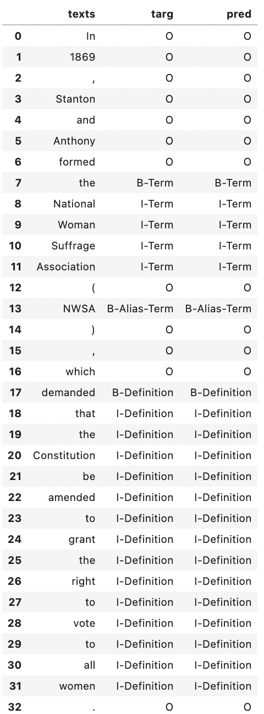
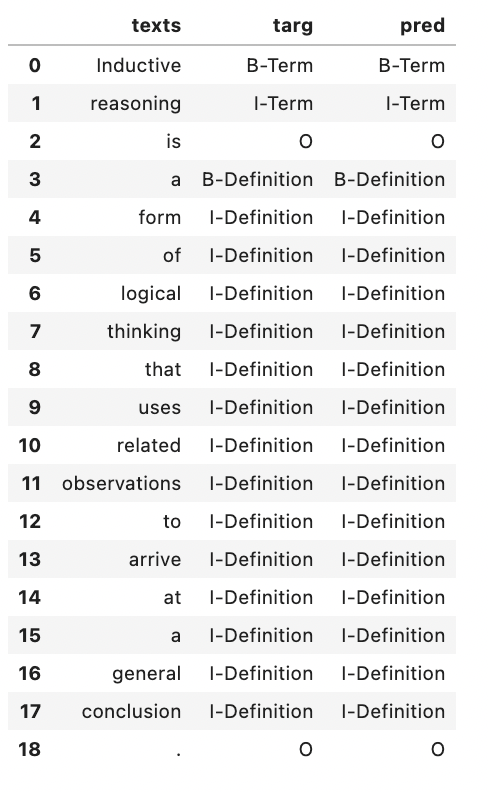
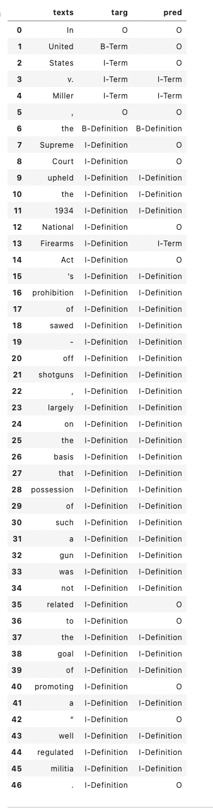
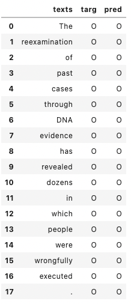

# Term Definition Extraction(Ongoing Project)

## Introduction

This project aims to extract terms and definition from given text.It is based on [Semeval 2020 task 6](https://competitions.codalab.org/competitions/22759)

The word tokens should be classified in the following categories:
- B-Alias-Term
- B-Alias-Term-frag
- B-Definition
- B-Definition-frag
- B-Qualifier
- B-Referential-Definition
- B-Referential-Term
- B-Secondary-Definition
- B-Term
- B-Term-frag
- I-Alias-Term
- I-Definition
- I-Definition-frag
- I-Qualifier
- I-Referential-Definition
- I-Referential-Term
- I-Secondary-Definition
- I-Term
- I-Term-frag
- O

## Preliminary performance

- **Validation accuracy: 0.87**
- **Validation micro F1 score: 0.87**
- **Validation macro F1 score: 0.37**

## Preliminary results example

### Example 1

### Example 2

### Example 3

### Example 4

